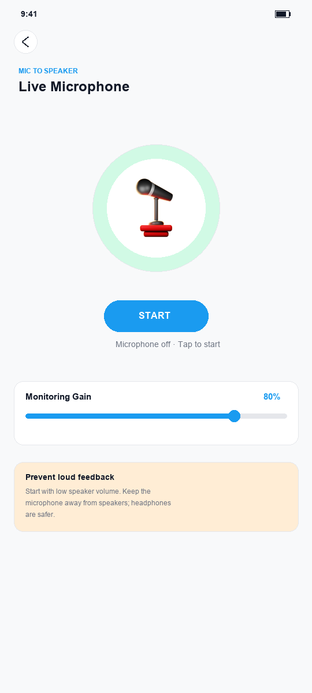
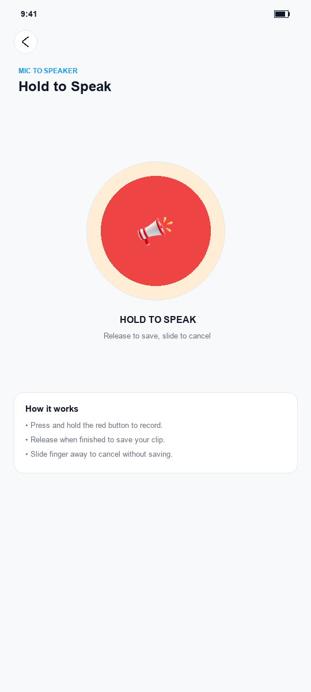
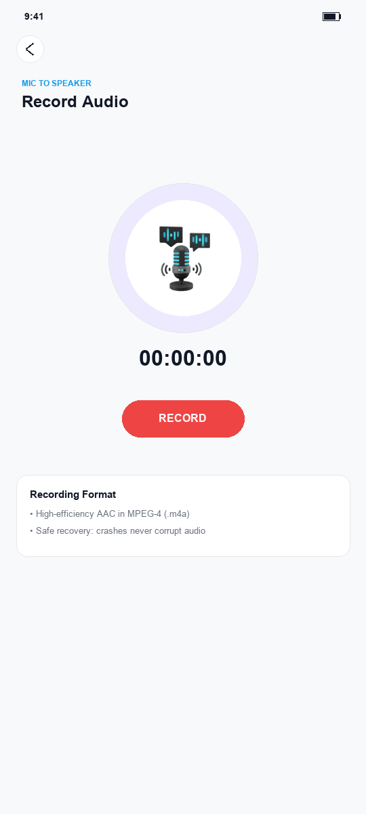
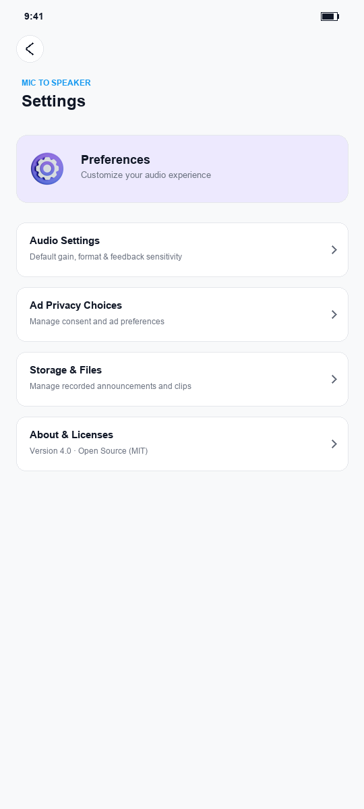
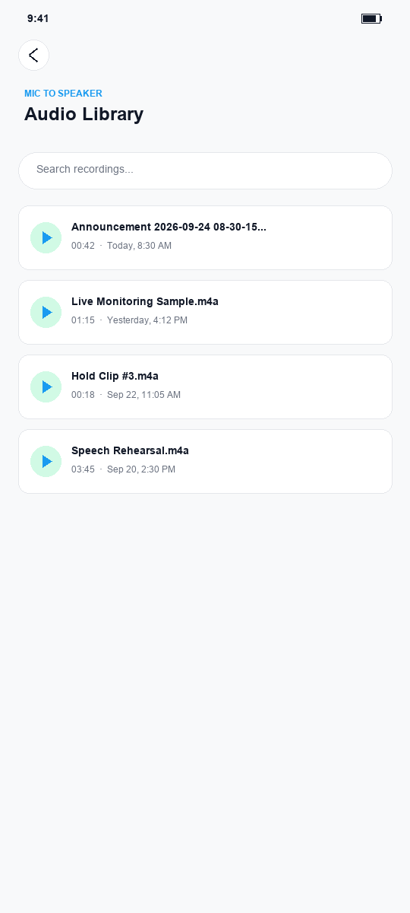

# Live Mic to Speakers

Turn your phone into a pocket PA: live microphone monitoring, hold-to-record announcements, saved
recordings and local audio playback — all on-device, with no account.

## What it does

Live Mic to Speakers amplifies your voice through the phone speaker in real time, records
press-and-hold announcements, keeps a library of saved clips, and plays them back. Everything runs
locally; recordings stay in the app's own folders and are removed when you uninstall.

### Features

- **Live microphone** — real-time monitoring with an input-level meter, an output-route readout and
  an adjustable monitoring-gain slider.
- **Hold to speak** — press and hold to record an announcement; release to save, slide away to cancel.
- **Recorder** — standalone AAC (`.m4a`) recording with a live level meter.
- **Audio library** — search, sort, preview, play and share; rename or delete saved recordings with
  a confirmation step.
- **Crash-safe saves** — in-flight recordings are tracked in a process-wide active registry during capture.
  When the audio library opens, finalized `.pending` clips are safely published, empty abandoned
  files older than 24 hours are removed, and unreadable recordings are quarantined as `.unrecovered`
  files rather than deleted, allowing users to review, permanently delete, or share them for support.
- **Privacy-minded ads** — ad measurement is deferred until consent allows it, and missing or
  offline ads never block navigation.

### Screenshots

Native screenshots illustrate the core surfaces in the refined pastel studio design: Live Microphone, Hold to Speak, Audio Recorder, Settings, and Audio Library.

### Safety first

- **Start at low speaker volume** and keep the microphone away from the speaker. Acoustic feedback
  can become very loud very quickly.
- **Headphones are safer.** Live monitoring automatically stops when a sustained loud, tonal acoustic
  feedback loop is detected for approximately one second, releasing the audio hardware and requiring a deliberate
  user restart.
- **What feedback detection cannot do:** It cannot prevent the first second of loud feedback while
  the condition is being verified, it may not catch every acoustic scenario (such as highly distorted,
  multi-frequency or intermittent howl), and it does not replace keeping volume low and using headphones.
- Disconnecting the output stops monitoring; you must start it again deliberately.
- The input meter is a relative indicator, not a calibrated sound-pressure meter.

## Build and test

- JDK 17, Android SDK 37, Gradle 9.7.1 (checksum-pinned wrapper distribution), AGP 9.4.0.
- Android 7 / API 24 remains the minimum supported version.
- `bash ./gradlew :app:assembleDebug :app:assembleRelease`
- `bash ./gradlew :app:testDebugUnitTest :app:testReleaseUnitTest :ads:testDebugUnitTest :ads:testReleaseUnitTest`
- `bash ./gradlew :app:lintDebug :app:lintRelease :ads:lintDebug`
- With an API 24+ device/emulator: `bash ./gradlew :app:connectedDebugAndroidTest`
- `python3 tools/check_quality_contract.py`
- `python3 -m unittest discover -s tools/tests -v`
- `bash ./gradlew :app:writeDependencyInventory`
- `python3 tools/check_dependency_policy.py app/build/reports/runtime-dependencies.json`
- **AdMob Test Device IDs:** Test device IDs are only activated in debuggable builds and are never packaged into release builds. To register your physical test device for debug runs, add `LIVE_MIC_TEST_DEVICE_IDS=<device_id_1>,<device_id_2>` to `local.properties` or pass `-PLIVE_MIC_TEST_DEVICE_IDS=<device_id>` on the command line. `AdRequest.DEVICE_ID_EMULATOR` is included automatically in debug builds.

GitHub Actions builds debug/release, runs lint and JVM regression checks, and runs Android tests on API 24, 34, 36 and 37, including APIs 36 and 37 at 200% font scale. Native screenshots are uploaded with the device-test reports for visual review. Inspect the checks on the pull request: a configured workflow is not proof that the final commit passed. A successful build also uploads `live-mic-debug-apk` for installation testing. Default release output uses demo ad configuration and is not a signed, device-verified production build.

See [NON_UI_MODERNIZATION.md](NON_UI_MODERNIZATION.md) for the Android 17 toolchain, lifecycle migration, dependency policy and maintenance safeguards. The core surfaces use a refined pastel studio design with border-first cards, restrained elevation, and scalable typography; visual acceptance still requires screenshot and physical-device review. [PRODUCTION_READINESS.md](PRODUCTION_READINESS.md) retains the production configuration and earlier core-screen accessibility work. Production bundles require explicit configuration; no real ad IDs or signing credentials are invented or committed.

## Audio and storage behavior

- **Paced audio loop:** Live monitoring uses blocking `AudioRecord.read()` calls on a dedicated background worker to pace the loop naturally, eliminating busy-waiting and sleep polling.
- **Low-latency playback:** On Android 8.0+ (API 26+), `AudioTrack` uses `PERFORMANCE_MODE_LOW_LATENCY` for minimum roundtrip delay, while maintaining compatibility with legacy constructors on API 24–25.
- **LiveGainProcessor:** Applies a 50ms linear gain ramp on startup to prevent click/pop transients, uses a tanh-like smooth soft limiter preventing harsh digital clipping, and monitors pre-gain audio for sustained tonal acoustic feedback (howling). When feedback is detected, audio is automatically muted, the session is safely stopped, and a clear prompt directs the user to lower speaker volume or use headphones before restarting.
- Output follows Android's selected media route. Hardware echo cancellation/noise suppression are optional, not guarantees of feedback-free or low-latency audio.
- Recorder preparation, finalization and cleanup use a serialized worker. Releasing a hold during preparation cancels the pending start. A queued save can finish after the screen closes without updating a destroyed Activity.
- Recording previews and the local-library preview share audio-focus and headphone-disconnect handling. Preview preparation is asynchronous.
- Microphone capture and playback are foreground-screen features, not background services. Saved-track playback retains its existing track/position/playing-intent restoration behavior, with lifecycle-owned typed state and immediate pause before unbinding.
- **Safe recording lifecycle:** In-flight recordings are tracked in a process-wide active registry during capture. New recordings stay under a `.pending` name until successful finalization, then become AAC in MPEG-4 (`.m4a`). History refreshes after publication, so unfinished files are not listed as saved. Existing MP3/M4A/WAV/AAC history remains readable.
- **0-byte purge & quarantine:** Stale pending sweeps only delete 0-byte abandoned files older than 24 hours. Interrupted or unreadable recordings containing non-empty audio are quarantined as `.unrecovered` files rather than destroyed, allowing users to review, permanently delete, or share them via the system share sheet.
- Cancelled, empty, sub-500ms and recorder-finalization failures are discarded. If publishing a completed recording fails, its `.pending` file is retained for recovery rather than overwriting an existing recording.
- Recordings remain in their existing app-specific folders. They are normally removed on uninstall; export anything important before uninstalling.
- Saved-history metadata scans and MediaStore queries run off the UI thread. Library playback uses MediaStore content URIs. Search matches the user's query and keeps playback identity stable while filtering.

## Sharing recordings

Long-press a saved recording and select **Share recording**, then choose the destination app. Sharing uses content URIs and temporary read-only access, not a raw file URI or a write grant. New M4A recordings use `audio/mp4`.

The provider exposes only the app's `Recording` and `HPRecording` folders (external app storage and internal fallback). Unrelated external storage, private files and cache files are excluded. Older files found in public Music folders remain playable when accessible; share those through your device's Files app rather than broadening this provider's access.

## Ads and privacy

- Mobile Ads is not initialized at application startup. Ad measurement is deferred explicitly. The UMP consent result must allow ad requests, and SDK initialization must finish, before the central ad gate opens.
- **User ad preference preservation:** The user's ad on/off toggle is persisted in SharedPreferences and respected across app sessions and configuration changes. The app never overwrites the user's choice with a hardcoded default at startup.
- The home screen gathers consent. Settings → **Ad privacy choices** exposes UMP privacy options when required, or permits retrying consent when unavailable.
- Banner/native resources belong to their screen and are destroyed on teardown or a privacy-state change. Fullscreen requests have separate completion callbacks; missing/offline ads do not block navigation. Dismissal while paused waits for resume, delivers once, and is discarded if the owner is destroyed.
- App-open ads are restricted to opted-in, resumed non-audio home screens. They are not shown over microphone, recording or playback screens.
- **Deployment requirement:** configure and test the application's privacy messages in AdMob, verify actual app/ad IDs and mediation behavior, and maintain a truthful privacy policy/Data Safety disclosure. This implementation is not a certification of legal or store-policy compliance.

## Safety and verification limits

Start at low speaker volume and keep the microphone away from speakers; headphones are safer. Acoustic feedback can become very loud. The input meter is a relative PCM indicator, not a calibrated sound-pressure meter.

JVM checks cover session ownership, cancellation, finalization, restart serialization, failure cleanup, finalized-file publication, consent readiness, deferred ad completion, search logic, audio MIME mapping and playback-state invariants. Android tests additionally exercise readable M4A recording, unpublished in-progress recordings, filtered playback identity, recording-provider boundaries, read-only sharing, measurement-deferral metadata and ad-flow resume/destruction with ads disabled, alongside navigation/recreation and core-layout checks. New tests cover recording-change owner lifecycles, service preparation without autoplay, typed errors, cleanup and installed-manifest policy. They do not validate regional consent, mediation network traffic or live ad rendering.

See [VALIDATION.md](VALIDATION.md) and [RELEASE_CHECKLIST.md](RELEASE_CHECKLIST.md) for evidence and device, privacy, sharing, accessibility and release sign-off. Source changes and emulator checks cannot establish real-device latency, Bluetooth quality or production readiness.

## License

Released under the [MIT License](LICENSE).
